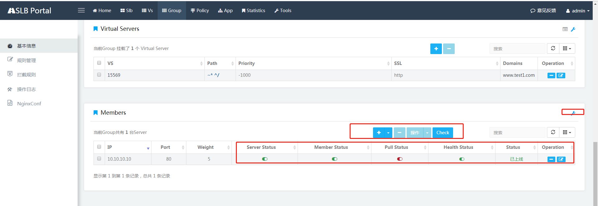

- [简介](#%e7%ae%80%e4%bb%8b)
- [快速入门（Quick Start)](#%e5%bf%ab%e9%80%9f%e5%85%a5%e9%97%a8quick-start)
  - [环境准备](#%e7%8e%af%e5%a2%83%e5%87%86%e5%a4%87)
  - [快速启动](#%e5%bf%ab%e9%80%9f%e5%90%af%e5%8a%a8)
    - [快速安装SLB Admin](#%e5%bf%ab%e9%80%9f%e5%ae%89%e8%a3%85slb-admin)
    - [初始化](#%e5%88%9d%e5%a7%8b%e5%8c%96)
    - [快速安装Health Checker](#%e5%bf%ab%e9%80%9f%e5%ae%89%e8%a3%85health-checker)
  - [手动配置](#%e6%89%8b%e5%8a%a8%e9%85%8d%e7%bd%ae)
    - [Mysql安装](#mysql%e5%ae%89%e8%a3%85)
    - [Nginx安装](#nginx%e5%ae%89%e8%a3%85)
    - [SLB Admin安装](#slb-admin%e5%ae%89%e8%a3%85)
    - [Health Checker 安装](#health-checker-%e5%ae%89%e8%a3%85)
- [进阶教程](#%e8%bf%9b%e9%98%b6%e6%95%99%e7%a8%8b)
- [模型介绍](#%e6%a8%a1%e5%9e%8b%e4%bb%8b%e7%bb%8d)
  - [SLB模型](#slb%e6%a8%a1%e5%9e%8b)
  - [VS模型](#vs%e6%a8%a1%e5%9e%8b)
  - [Group模型](#group%e6%a8%a1%e5%9e%8b)
  - [TrafficPolicy模型](#trafficpolicy%e6%a8%a1%e5%9e%8b)
  - [证书模型](#%e8%af%81%e4%b9%a6%e6%a8%a1%e5%9e%8b)
- [简单上手](#%e7%ae%80%e5%8d%95%e4%b8%8a%e6%89%8b)
  - [创建SLB](#%e5%88%9b%e5%bb%baslb)
  - [创建VS](#%e5%88%9b%e5%bb%bavs)
  - [创建Group](#%e5%88%9b%e5%bb%bagroup)
  - [拉入拉出](#%e6%8b%89%e5%85%a5%e6%8b%89%e5%87%ba)
  - [请求验证](#%e8%af%b7%e6%b1%82%e9%aa%8c%e8%af%81)
- [设计文档](#%e8%ae%be%e8%ae%a1%e6%96%87%e6%a1%a3)
- [用户手册](#%e7%94%a8%e6%88%b7%e6%89%8b%e5%86%8c)
- [API文档](#api%e6%96%87%e6%a1%a3)
- [Q&A](#qa)
## 简介
Soft Load Balancer at ctrip.com

SLB是携程的软负载系统，主要用于提供HTTP协议的路由负载功能，日处理请求量峰值达千亿。

核心功能包括：
1. 路由转发
2. 负载均衡
3. 缩容扩容
4. 服务器拉入拉出
5. 独立健康检测
6. HTTPS证书管理
7. 请求实时监控
8. 流量灰度迁移
9. URL Rewrite
10. 反爬虫拦截策略
11. 操作日志
12. 权限管理

我们提供了丰富的API与发布系统和运维系统无缝接合，提供便捷的可视化操作界面 SLB Portal。

## 快速入门（Quick Start)

### 环境准备
1. 首先需要准备一台装有Centos操作系统机器，本文档使用的版本号7.6.1810 
    1. 安装jdk 1.8
    2. 安装MySQL Community Server 5.6.21 及以上版本，参照https://dev.mysql.com/doc/mysql-installation-excerpt/5.7/en/linux-installation.html
    3. 安装Apache Maven 3.3.9 及以上版本
    4. 开通root账号权限
2. 机器能够联通Github并下载Github项目

### 快速启动
通过执行SLB Admin、HealthChecker的两个shell脚本，用户可以方便的安装整个系统。

#### 快速安装SLB Admin
1. 代码下载,【这里需要提供github的地址】
2. 数据库创建,通过MySQL WorkBench创建SLB数据库，如 **slb**
2. 快速安装：
    1. 代码根目录下找到setup.sh 文件，修改setup.sh的编码以及执行权限， 即：
    
    ```
    dos2unix setup.sh
    chmod +x setup.sh
    ```
    2. 执行./setup.sh 
    
    ```
    [root@UAT14970 ygshen]# ./setup.sh
    Java check passed # 检查Java版本，需要Java1.8
    Jps check passed # 检查JPS是否安装
    Nginx check passed # Nginx安装、版本check
    Success to start nginx # 启动Nginx 进程
    Where is your DB Server?mysql.server.path #询问数据库服务器的地址，可以是IP、FQDN名称。
    DB Server Port?3306 #数据库的连接端口，默认3306
    DB Name?slb #SLB使用的数据库名称。即第二步创建的数据库
    DB User Name?root #数据库的连接用户
    DB password?123456 #数据库用户密码
    Successfully Install SLB Admin #启动成功
    ```

#### 初始化
经过以上步骤，SLB Admin已经成功启动。 但是SLB Admin需要的数据库还是空的，尚未创建表以及填充启动数据。 如：系统Admin账号、系统需要的默认证书等。 请参照以下步骤初始化

1. 浏览器访问 SLB Admin 如： http://127.0.0.1:8099/api/slbs 系统会检测到数据库尚未初始化，用户会被redirect到 http://127.0.0.1:8099/portal/env 初识化页面。
2. 初始化包括: 
    1. SLB Admin Api的地址。 默认为以上安装步骤中使用的虚拟机如： http://127.0.0.1:8099 。 此时可以使用默认值，后续可以修改。 
    2. 数据库的创建、初始数据的填充都是自动的。无需人为干预
3. 初始化页面点击 设置。 设置成功后会自动跳转到系统首页
    
#### 快速安装Health Checker

1. 代码下载,【这里需要提供github的地址】
2. 快速安装：
    1. 代码根目录下找到setup.sh 文件，修改setup.sh的编码以及执行权限， 即：
    
    ```
    dos2unix setup.sh
    chmod +x setup.sh
    ```
    2. 执行./setup.sh 
    
    ```
    [root@]# ./setup.sh
    Java check passed # 检查Java版本，需要Java1.8
    Jps check passed # 检查JPS是否安装
    Nginx check passed # Nginx安装、版本check
    Success to start nginx # 启动Nginx 进程
    Where is your DB Server?mysql.server.path #询问数据库服务器的地址，可以是IP、FQDN名称。
    DB Server Port?3306 #数据库的连接端口，默认3306
    DB Name?slb #SLB使用的数据库名称。即第二步创建的数据库
    DB User Name?root #数据库的连接用户
    DB password?123456 #数据库用户密码
    Successfully Install SLB Admin #启动成功
    ```

### 手动配置
以上快速启动，通过脚本一键安装SLB、Nginx、Healthchecker。如需了解安装过程中涉及的详细步骤请参照以下部分

#### Mysql安装
1. 版本： MySQL Community Server  5.6.21
2. 安装方法参照： https://dev.mysql.com/doc/mysql-installation-excerpt/5.7/en/linux-installation.html
3. 安装完成后创建空的数据库，数据库名称： **open** 

#### Nginx安装
1. 下载最新的SLB Admin代码。
2. Nginx 安装包在项目根目录，如：[Root]/startup/slb-nginx-1.14.1-3.el7.x86_64.rpm
3. 将以上rmp包copy到虚拟机如 /opt/。
4. Root账号下Yum安装Nginx依赖的第三方组件。 
    1. pcre-devel >= 7.6
    2. jemalloc >= 3.4
    3. jemalloc-devel >= 3.4
    ```
    yum install jemalloc-devel
    yum install jemalloc
    yum install pcre-devel
    yum install dos2unix
    ```
4. Root账号下下运行: 
     ```
     rpm -i slb-nginx-1.14.1-3.el7.x86_64.rpm
     ```
5. 安装过程入遇到以下报错， 可以查看系统日志：  
    
    ```
    journalctl -xe
    ```
    如有以下错误，可以先跳过在第7步解决。 如无报错请参照第8步验证Nginx已经启动
    ```
    nginx: the configuration file /opt/app/nginx/conf/nginx.conf syntax is ok
    nginx: [emerg] open() "/opt/logs/nginx/error.log" failed (2: No such file or directory)
    nginx: configuration file /opt/app/nginx/conf/nginx.conf test failed
    nginx.service: control process exited, code=exited status=1
    Failed to start nginx - high performance web server.
    ```
5. 如第5步报错，请参照本步骤。如没有错误，请忽略本步骤。
    1. root账号启动Nginx, 执行命令
        ```
        /opt/app/ngxin/sbin/nginx 
        ```
6. 验证Nginx启动成功： ps aux | grep nginx 验证nginx进程已经启动


#### SLB Admin安装
1. 下载最新的SLB Admin代码。
2. 建议使用IDEA编辑器打开项目源码。
2. 编辑数据库连接串： 打开根目录下property 文件。 如：[Root]/slb/conf/open-source/db.properties 修改DB连接串。
    1. url: 数据库连接串,本文采用的是本地安装所以配置了: 127.0.0.1; 可以设置远程机器。 端口号本文使用的是3306.  
    2. username: 连接数据库的用户名
    3. password：连接数据库的密码
    ```
    driverClassName=com.mysql.jdbc.Driver
    url=jdbc:mysql://127.0.0.1:3306/open?autoReconnect=true&useSSL=false&allowMultiQueries=true
    username=root
    password=123456
    initialSize=0
    connectionProperties=useUnicode=true;characterEncoding=UTF-8;autoReconnect=true;useSSL=false
    maxActive=300
    maxIdle=10
    minIdle=1
    
    ```
    
2. 设置环境变量：打开 [Root]/slb/scripts/startup-open-source.sh 文件修改以下两个参数
    1. JAVA_PATH: 虚拟机上java的安装目录。 
    2. API_BASE_URL: SLB Admin API 地址。 当前API机器为第一步准备的机器host ip
    
    ```
    export JAVA_PATH="/usr/java/jdk1.8/bin/java"
    export API_BASE_URL="http://[hostip]:8099"
    ```
3. 编译：根目录下执行 
    
    ```
    mvn clean package
    ```

3. 编译成功
4. 将target目录下生成的zip包如:[Root]\slb\target\slb-1.0.1.zip 发送到虚拟机
5. 虚拟机上root执行一下命令
 
    
    ```
    
    sudo -i
    
    cd /opt/
    mv your-path-to-slb-1.0.1.zip .
    
    unzip slb-1.0.1.zip -d /opt/slb
    cd slb/scripts/
    dos2unix *
    
    ./startup-open-source.sh
    
    ```
6. 安装成功会有提示： 

    ```
    Starting SlbAdmin
    SlbAdmin started: 30199 # 进程ID
    ```
7. 如果失败可以执行以下命令查看错误日志以及操作日志等 
    
    ```
    vi ../logs/err.txt 
    vi ../logs/zeus.log 
    ```

8. 验证： 访问 http://127.0.0.1:8099/api/slbs 如果可以访问，证明启动成功，可以继续以下步骤

#### Health Checker 安装

1. 下载最新的HealthChecker代码
2. 启动脚本配置：
    1. 配置[Root]\HealthChecker\scripts\env-opensource.sh启动脚本. "SLB_CONFIG_URL"代表slb admin的api地址，此API用于获取healthchecker自身的配置。 如

    ```
    export SLB_CONFIG_URL="http://127.0.0.1:8099/api/hc/properties"
    ```
2. 根目录 如:[Root]\healthchecker下执行以下命令执行编译
    
    ```
    mvn clean package
    ```
3. 编译成功后将根目录target文件夹内的zip包(如： [Root]\HealthChecker\target\health-checker-1.zip) Copy到与SLB Admin相同的一台虚拟机上。

4. 登陆虚拟机，解压缩并启动HealthChecker。执行以下脚本

    ```
    sudo -i
    cd /opt/
    mv your-path-to-health-checker-1.zip .
    unzip health-checker-1.zip -d healthchecker
    cd /opt/healthchecker/scripts
    dos2unix *
    ./startup-opensource.sh
    ```
    启动成功标示：
    
    ```
    Starting HealthChecker
    HealthChecker started: 3964 # 进程ID
    ```

## 进阶教程
## 模型介绍
### SLB模型

1. slb模型表示一组部署了携程的软负载均衡器（soft load balancer, SLB）进程的服务器，表示一个slb部署实例。
2. 主要对外提供请求转发以及负载均衡的作用，其他的额外功能包括对应用服务器的扩容缩容，拉入拉出以及健康检测等。
3. 底层使用nginx实现路由转发和负载均衡。
4. 对外使用虚拟IP（virtual IP, VIP）表示该slb集群，一个slb集群可以有多个VIP。

### VS模型

1. 代表了一组提供相同服务的域名，是携程自定义的域名管理单元。

2. 其定义了一组域名和一个端口，表示可以接收来自这组域名的这个端口的流量。如一个vs的定义如下：

   ```javascript
   vs: {
       "domains":[
           "abc.com",
           "def.com"
       ],
       "port": 80
   }
   ```

   则表示这个vs可以处理域名为abc.com以及def.com的端口号为80（即HTTP请求）的请求。

### Group模型

1. 表示一组运行相同代码的能够对外提供相同服务的进程

2. 是SLB系统管理的基本单元，大多数的运维操作是针对Group的

3. 其定义了一组应用服务器（server ips），以及与之相关联的一组vs。对于关联的每个vs，定义了如下属性：

   ```java
   // 表示group接收请求的统一路径前缀
   private String path;
   // 表示group在该vs下的优先级。当对于某个URL在同一个vs下存在多个group的path与之匹配时，优先将请求转发给优先级较高的group
   private Integer priority;
   ```

### TrafficPolicy模型

1. 表示一个流量分配策略。
2. 作为一个在vs和group中间流量分配的组件，其向上关联了一组vs，并制定了接受请求的路径前缀以及相应的优先级（路径和优先级的定义可参照group）；向下关联了一组group，可以指定不同group之间的流量比重。

### 证书模型

1. SLB在数据库中保存一本SSL证书的私钥文件和公钥文件，以及其他额外信息，如证书的颁发时间，过期时间域名等。
2. SLB在内部将一本证书与任意多个vs相关联，即关联的vs下的所有域名的请求都会被证书保护。
3. SLB会将公钥文件和私钥文件安装在和vs相关联的每一台SLB服务器上。

## 简单上手
### 创建SLB

1. 从slb列表页点击新建按钮进入新建slb页面
2. 自上而下填入必要信息
   1. 名称：slb集群名称
   2. vip列表：该slb集群相关联的VIP列表
   3. Slb Servers列表：该slb集群中的服务器的IP列表
3. 点击提交完成
    
    
### 创建VS

1. 如下图进入vs列表页，点击新建进入vs新建页。
2. 依次填写以下信息
   1. Name：VS名称
   2. IsSSL：若勾选上表示该VS接收HTTPS请求，否则表示该VS接收HTTP请求
   3. SLB列表：与该VS相关联的SLB列表
   4. Domain列表：该VS中包含的域名列表
3. 点击提交完成
    
    
### 创建Group

1. 如下图进入group列表页，点击新建按钮进入group新建页。
2. 依次填写如下信息：
   1. Name：group名称
   2. IsSSL：默认状态为不勾选状态，无法更改。
   3. GroupVirtualServers：表示与group相关联的VS信息，点击左侧“+”号按钮新增一个groupvirutalserver，依次填写group接收请求的路径前缀，其他信息可不填，点击提交保存。
   4. Healthcheck URL：用于检测检测的URL地址，用于测试服务是否正常。
   5. Healthcheck Policy，依次填入以下信息
      1. Timeout：表示一次健康检测的超时时间，即一旦超过该时间应用服务器仍未返回结果，即认为此次健康检测失败。
      2. Intervals：每次健康监测间隔时长。
      3. Fails：最大健康检测失败次数，超过该次数即认为应用服务器健康监测失败
      4. Passes：失败后检测成功次数阈值。假设该值为3，即连续三次检测检测成功才认为应用恢复正常。
   6. LBMethod：负载均衡方法，表示SLB在向后端服务器转发请求时，在不同的应用服务器之间的调度算法。目前SLB只支持权重轮询调度算法（Weight Round-Robin Scheduling）。
   7. Group Servers：表示该group包含的一组应用服务器
    
    
### 拉入拉出
进入group详情页，如下图所示。点击Members表格右上方的扳手按钮。有四个状态位可以调节，分别是：
1. Server Status：服务器拉入状态位，用以控制该台服务器上的所有的group成员的拉入状态（慎用）
2. Member Status：group成员拉入状态位，用以控制该group成员的拉入状态（推荐使用），用户可通过该状态位控制group成员的拉入拉出状态。
3. Pull Status：group成员的发布拉入状态，由发布系统控制
4. Health Status：group成员的健康检测拉入状态位，由健康检测系统控制。
    
### 请求验证

在用户创建了slb集群，VS以及group之后，用户可以通过发送请求的方式检验SLB的转发功能。

假设在本地创建了一台slb服务器，并创建了一个vs，其中包含一个域名，yourdomain.com，并绑定了端口80。除此之外，用户在本地部署了应用，可以yourdomain.com/someres的请求。

现用户只需将yourdomain.com绑定到本地（通过编辑hosts文件），并向域名发送请求/someres，用户可以发现，请求已经到达了本地部署的应用之中。

## 设计文档
参照： [SLB 设计文档]()
## 用户手册
参照： [SLB 用户手册]()
## API文档
参照： [SLB API文档]()
## Q&A
参照： [SLB Q&A]()